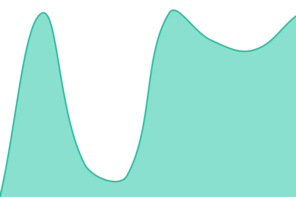
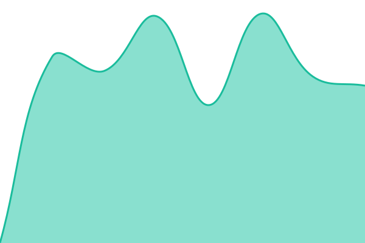
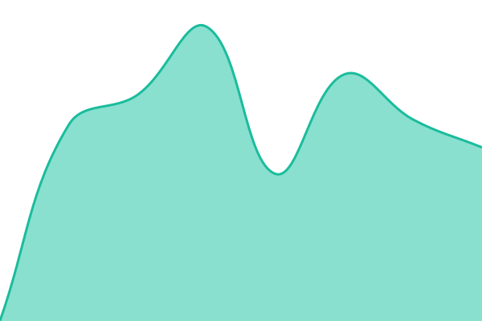
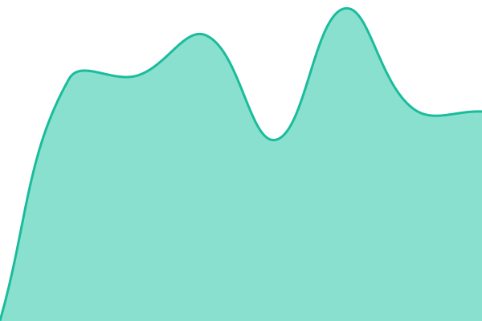

# [📈 Live Status](https://uptime.danieljohnmorris.com): <!--live status--> **🟩 All systems operational**

This repository contains the open-source uptime monitor and status page for [Daniel Morris](https://danieljohnmorris.com), powered by [Upptime](https://github.com/upptime/upptime).

With [Upptime](https://upptime.js.org), you can get your own unlimited and free uptime monitor and status page, powered entirely by a GitHub repository. We use [Issues](https://github.com/danieljohnmorris/upptime/issues) as incident reports, [Actions](https://github.com/danieljohnmorris/upptime/actions) as uptime monitors, and [Pages](https://uptime.danieljohnmorris.com) for the status page.

<!--start: status pages-->
<!-- This summary is generated by Upptime (https://github.com/upptime/upptime) -->
<!-- Do not edit this manually, your changes will be overwritten -->
<!-- prettier-ignore -->
| URL | Status | History | Response Time | Uptime |
| --- | ------ | ------- | ------------- | ------ |
|  [Main site](https://danieljohnmorris.com) | 🟩 Up | [main-site.yml](https://github.com/danieljohnmorris/upptime/commits/HEAD/history/main-site.yml) | 

 1100ms
     
 | 

<a href="https://uptime.danieljohnmorris.com/history/main-site">100.00%</a>
    

|  [Dokploy](https://deploy.danieljohnmorris.com) | 🟩 Up | [dokploy.yml](https://github.com/danieljohnmorris/upptime/commits/HEAD/history/dokploy.yml) | 

 930ms
     
 | 

<a href="https://uptime.danieljohnmorris.com/history/dokploy">100.00%</a>
    

|  [Analytics (Umami tracker)](https://analytics.danieljohnmorris.com/script.js) | 🟩 Up | [analytics-umami-tracker.yml](https://github.com/danieljohnmorris/upptime/commits/HEAD/history/analytics-umami-tracker.yml) | 

 202ms
     
 | 

<a href="https://uptime.danieljohnmorris.com/history/analytics-umami-tracker">100.00%</a>
    

|  [3D Flock](https://3d-flock.danieljohnmorris.com) | 🟩 Up | [3-d-flock.yml](https://github.com/danieljohnmorris/upptime/commits/HEAD/history/3-d-flock.yml) | 

 686ms
     
 | 

<a href="https://uptime.danieljohnmorris.com/history/3-d-flock">100.00%</a>
    

|  [3D House](https://3d-house.danieljohnmorris.com) | 🟩 Up | [3-d-house.yml](https://github.com/danieljohnmorris/upptime/commits/HEAD/history/3-d-house.yml) | 

 979ms
     
 | 

<a href="https://uptime.danieljohnmorris.com/history/3-d-house">100.00%</a>
    

|  [3D Parallax](https://3d-parallax.danieljohnmorris.com) | 🟩 Up | [3-d-parallax.yml](https://github.com/danieljohnmorris/upptime/commits/HEAD/history/3-d-parallax.yml) | 

 938ms
     
 | 

<a href="https://uptime.danieljohnmorris.com/history/3-d-parallax">100.00%</a>
    

|  [3D Waves](https://3d-waves.danieljohnmorris.com) | 🟩 Up | [3-d-waves.yml](https://github.com/danieljohnmorris/upptime/commits/HEAD/history/3-d-waves.yml) | 

 838ms
     
 | 

<a href="https://uptime.danieljohnmorris.com/history/3-d-waves">100.00%</a>
    

|  [Clouds 3D](https://clouds-3d.danieljohnmorris.com) | 🟩 Up | [clouds-3-d.yml](https://github.com/danieljohnmorris/upptime/commits/HEAD/history/clouds-3-d.yml) | 

 875ms
     
 | 

<a href="https://uptime.danieljohnmorris.com/history/clouds-3-d">100.00%</a>
    

|  [Clouds Noise](https://clouds-noise.danieljohnmorris.com) | 🟩 Up | [clouds-noise.yml](https://github.com/danieljohnmorris/upptime/commits/HEAD/history/clouds-noise.yml) | 

 757ms
     
 | 

<a href="https://uptime.danieljohnmorris.com/history/clouds-noise">100.00%</a>
    

|  [Go 5x5](https://go-5x5.danieljohnmorris.com) | 🟩 Up | [go-5x5.yml](https://github.com/danieljohnmorris/upptime/commits/HEAD/history/go-5x5.yml) | 

 919ms
     
 | 

<a href="https://uptime.danieljohnmorris.com/history/go-5x5">100.00%</a>
    

|  [Go 5x5 KataGo](https://go-5x5-katago.danieljohnmorris.com) | 🟩 Up | [go-5x5-kata-go.yml](https://github.com/danieljohnmorris/upptime/commits/HEAD/history/go-5x5-kata-go.yml) | 

 913ms
     
 | 

<a href="https://uptime.danieljohnmorris.com/history/go-5x5-kata-go">100.00%</a>
    

|  [Harmonia](https://harmonia.danieljohnmorris.com) | 🟩 Up | [harmonia.yml](https://github.com/danieljohnmorris/upptime/commits/HEAD/history/harmonia.yml) | 

 528ms
     
 | 

<a href="https://uptime.danieljohnmorris.com/history/harmonia">100.00%</a>
    

|  [Live Search (HTMX)](https://live-search-htmx.danieljohnmorris.com) | 🟩 Up | [live-search-htmx.yml](https://github.com/danieljohnmorris/upptime/commits/HEAD/history/live-search-htmx.yml) | 

 513ms
     
 | 

<a href="https://uptime.danieljohnmorris.com/history/live-search-htmx">100.00%</a>
    

|  [Live Search (RSC)](https://live-search-rsc.danieljohnmorris.com) | 🟩 Up | [live-search-rsc.yml](https://github.com/danieljohnmorris/upptime/commits/HEAD/history/live-search-rsc.yml) | 

 684ms
     
 | 

<a href="https://uptime.danieljohnmorris.com/history/live-search-rsc">100.00%</a>
    

|  [Map](https://map.danieljohnmorris.com) | 🟩 Up | [map.yml](https://github.com/danieljohnmorris/upptime/commits/HEAD/history/map.yml) | 

 678ms
     
 | 

<a href="https://uptime.danieljohnmorris.com/history/map">100.00%</a>
    

|  [Nastia](https://nastia.danieljohnmorris.com) | 🟩 Up | [nastia.yml](https://github.com/danieljohnmorris/upptime/commits/HEAD/history/nastia.yml) | 

 667ms
     
 | 

<a href="https://uptime.danieljohnmorris.com/history/nastia">100.00%</a>
    

|  [Status page (on-box)](https://status.danieljohnmorris.com) | 🟩 Up | [status-page-on-box.yml](https://github.com/danieljohnmorris/upptime/commits/HEAD/history/status-page-on-box.yml) | 

 520ms
     
 | 

<a href="https://uptime.danieljohnmorris.com/history/status-page-on-box">100.00%</a>
    

|  [Status API (on-box)](https://api.status.danieljohnmorris.com/health) | 🟩 Up | [status-api-on-box.yml](https://github.com/danieljohnmorris/upptime/commits/HEAD/history/status-api-on-box.yml) | 

 520ms
     
 | 

<a href="https://uptime.danieljohnmorris.com/history/status-api-on-box">100.00%</a>
    

|  [ilo-lang.ai](https://ilo-lang.ai) | 🟩 Up | [ilo-lang-ai.yml](https://github.com/danieljohnmorris/upptime/commits/HEAD/history/ilo-lang-ai.yml) | 

 819ms
     
 | 

<a href="https://uptime.danieljohnmorris.com/history/ilo-lang-ai">100.00%</a>
    

|  [ilo convert API](https://convert.ilo-lang.ai/health) | 🟩 Up | [ilo-convert-api.yml](https://github.com/danieljohnmorris/upptime/commits/HEAD/history/ilo-convert-api.yml) | 

 789ms
     
 | 

<a href="https://uptime.danieljohnmorris.com/history/ilo-convert-api">100.00%</a>
    

|  [Lightning CV site](https://lightningcv.io) | 🟩 Up | [lightning-cv-site.yml](https://github.com/danieljohnmorris/upptime/commits/HEAD/history/lightning-cv-site.yml) | 

 681ms
     
 | 

<a href="https://uptime.danieljohnmorris.com/history/lightning-cv-site">100.00%</a>
    

|  [Lightning CV app](https://app.lightningcv.io) | 🟩 Up | [lightning-cv-app.yml](https://github.com/danieljohnmorris/upptime/commits/HEAD/history/lightning-cv-app.yml) | 

 2048ms
     
 | 

<a href="https://uptime.danieljohnmorris.com/history/lightning-cv-app">100.00%</a>
    

|  [Counselling Supervisor](https://counselling-supervisor.ai) | 🟩 Up | [counselling-supervisor.yml](https://github.com/danieljohnmorris/upptime/commits/HEAD/history/counselling-supervisor.yml) | 

 672ms
     
 | 

<a href="https://uptime.danieljohnmorris.com/history/counselling-supervisor">100.00%</a>
    

|  [Bugsink](https://bugsink.danieljohnmorris.com/accounts/login/) | 🟩 Up | [bugsink.yml](https://github.com/danieljohnmorris/upptime/commits/HEAD/history/bugsink.yml) | 

 512ms
     
 | 

<a href="https://uptime.danieljohnmorris.com/history/bugsink">100.00%</a>
    

<!--end: status pages-->

[**Visit our status website →**](https://uptime.danieljohnmorris.com)

## 📄 License

- Powered by: [Upptime](https://github.com/upptime/upptime)
- Code: [MIT](./LICENSE) © [Anand Chowdhary](https://anandchowdhary.com)
- Data in the `./history` directory: [Open Database License](https://opendatacommons.org/licenses/odbl/1-0/)
